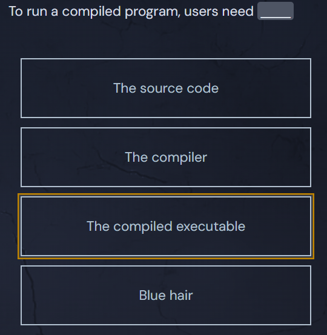

<h1>Compiled vs. Interpreted</h1>

You can run a compiled program <em>without</em> the original source code. You don't need the compiler anymore after it's done its job. That's how most video games are distributed! Players don't need to install the correct version of <code>Go</code> to run a PC game: they just download the executable game and run it.

With interpreted languages like Python and Ruby, the code is interpreted at <a href="https://en.wikipedia.org/wiki/Runtime_(program_lifecycle_phase)" target="_blank" rel="noopener nofollow">runtime</a> by a separate program known as the "interpreter". Distributing code for users to run can be a pain because they need to have an interpreter installed, and they need access to the source code.

<svg class="details-icon" xmlns="http://www.w3.org/2000/svg" fill="none" viewBox="0 0 24 24" stroke-width="1.5" stroke="currentColor">
  <path d="m9 18 6-6-6-6"></path>
</svg>
<h2>Examples of Compiled Languages</h2>

<ul>
<li>Go</li>
<li>C</li>
<li>C++</li>
<li>Rust</li>
</ul>

<svg class="details-icon" xmlns="http://www.w3.org/2000/svg" fill="none" viewBox="0 0 24 24" stroke-width="1.5" stroke="currentColor">
  <path d="m9 18 6-6-6-6"></path>
</svg>
<h2>Examples of Interpreted Languages</h2>

<ul>
<li>JavaScript (sometimes JIT-compiled, but a similar concept)</li>
<li>Python</li>
<li>Ruby</li>
</ul>

<svg class="details-icon" xmlns="http://www.w3.org/2000/svg" fill="none" viewBox="0 0 24 24" stroke-width="1.5" stroke="currentColor">
  <path d="m9 18 6-6-6-6"></path>
</svg>
<h2>Why Build Textio in a Compiled Language?</h2>

One of the most convenient things about using a compiled language like Go for Textio is that when we deploy our server we don't need to include any runtime language dependencies like Node or a Python interpreter. We just add the pre-compiled binary to the server and start it up!

<video src="https://storage.googleapis.com/qvault-webapp-dynamic-assets/lesson_videos/compiled-vs-interpreted-languages.mp4" controls="" controlslist="nodownload" preload="metadata" playsinline="" width="1080"" poster="https://storage.googleapis.com/qvault-webapp-dynamic-assets/course_assets/gUNRY9t.png">
Your browser does not support playing HTML5 video.
You can <a href="https://storage.googleapis.com/qvault-webapp-dynamic-assets/lesson_videos/compiled-vs-interpreted-languages.mp4" download="">download the file</a> instead.
Here is a description of the content: compiled vs interpreted languages
</video><button class="video-info-button absolute top-2 right-2 z-10 p-1 bg-gray-900/60 rounded-full text-gray-300 hover:text-gray-100" aria-label="Video playback information"><svg xmlns="http://www.w3.org/2000/svg" width="24" height="24" viewBox="0 0 24 24" fill="none" stroke="currentColor" stroke-width="1.5" stroke-linecap="round" stroke-linejoin="round" class="lucide lucide-info-icon lucide-info"><circle cx="12" cy="12" r="10"></circle><path d="M12 16v-4"></path><path d="M12 8h.01"></path></svg></button>

## Quiz Results

*Quiz completed successfully*