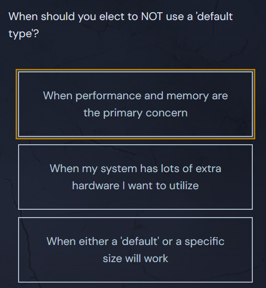

<h1>Which Type Should I Use?</h1>

With so many types for what is essentially just a number, developers coming from languages that only have one kind of <code>Number</code> type (like JavaScript) may find the choices daunting.

<svg class="details-icon" xmlns="http://www.w3.org/2000/svg" fill="none" viewBox="0 0 24 24" stroke-width="1.5" stroke="currentColor">
  <path d="m9 18 6-6-6-6"></path>
</svg>
<h2>Prefer “Default” Types</h2>

A problem arises when we have a <code>uint16</code>, and the function we are trying to pass it into takes an <code>int</code>. We're forced to write code riddled with type conversions like:

  <pre class="language-go" tabindex="0"><code class="language-go">var myAge uint16 = 25
myAgeInt := int(myAge)
</code></pre>

  <button class="markdown-it-code-copy absolute right-2 top-2.5 z-10 m-1 h-6 w-6 cursor-pointer rounded bg-gray-950 text-gray-500 focus:outline-white hover:text-gray-200" data-clipboard-text="var myAge uint16 = 25
myAgeInt := int(myAge)" title="Copy to clipboard">
    <svg data-slot="icon" aria-hidden="true" fill="none" stroke-width="1.5" stroke="currentColor" viewBox="0 0 24 24" xmlns="http://www.w3.org/2000/svg">
      <rect width="8" height="4" x="8" y="2" rx="1" ry="1"></rect><path d="M16 4h2a2 2 0 0 1 2 2v14a2 2 0 0 1-2 2H6a2 2 0 0 1-2-2V6a2 2 0 0 1 2-2h2"></path>
  </svg>
  </button>

This style of code can be slow and annoying to read. When Go developers stray from the “default” type for any given type family, the code can get messy quickly. Unless you have a good <em>performance related</em> reason, you'll typically just want to use the "default" types:

<ul>
<li><code>bool</code></li>
<li><code>string</code></li>
<li><code>int</code></li>
<li><code>uint</code></li>
<li><code>byte</code></li>
<li><code>rune</code></li>
<li><code>float64</code></li>
<li><code>complex128</code></li>
</ul>

<svg class="details-icon" xmlns="http://www.w3.org/2000/svg" fill="none" viewBox="0 0 24 24" stroke-width="1.5" stroke="currentColor">
  <path d="m9 18 6-6-6-6"></path>
</svg>
<h2>When Should I Use a More Specific Type?</h2>

When you're super concerned about performance and memory usage.

That’s about it. The only reason to deviate from the defaults is to squeeze out every last bit of performance when you are writing an application that is resource-constrained. (Or, in the special case of <code>uint64</code>, you need an absurd range of unsigned integers).

You can <a href="https://blog.boot.dev/golang/default-native-types-golang/" target="_blank" rel="noopener nofollow">read more on this subject here</a> if you'd like, but it's not required.

## Quiz Results

*Quiz completed successfully*

