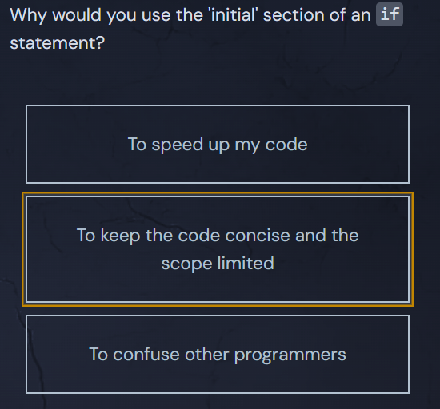

<h1>The Initial Statement of an If Block</h1>

An <code>if</code> conditional can have an "initial" statement. The variable(s) created in the initial statement are <em>only</em> defined within the scope of the <code>if</code> body.

  <pre class="language-go" tabindex="0"><code class="language-go">if INITIAL_STATEMENT; CONDITION {
}
</code></pre>

  <button class="markdown-it-code-copy absolute right-2 top-2.5 z-10 m-1 h-6 w-6 cursor-pointer rounded bg-gray-950 text-gray-500 focus:outline-white hover:text-gray-200" data-clipboard-text="if INITIAL_STATEMENT; CONDITION {
}" title="Copy to clipboard">
    <svg data-slot="icon" aria-hidden="true" fill="none" stroke-width="1.5" stroke="currentColor" viewBox="0 0 24 24" xmlns="http://www.w3.org/2000/svg">
      <rect width="8" height="4" x="8" y="2" rx="1" ry="1"></rect><path d="M16 4h2a2 2 0 0 1 2 2v14a2 2 0 0 1-2 2H6a2 2 0 0 1-2-2V6a2 2 0 0 1 2-2h2"></path>
  </svg>
  </button>

<svg class="details-icon" xmlns="http://www.w3.org/2000/svg" fill="none" viewBox="0 0 24 24" stroke-width="1.5" stroke="currentColor">
  <path d="m9 18 6-6-6-6"></path>
</svg>
<h2>Why Would I Use This?</h2>

It has two valuable purposes:

<ol>
<li>It's a bit shorter</li>
<li>It limits the scope of the initialized variable(s) to the <code>if</code> block</li>
</ol>

For example, instead of writing:

  <pre class="language-go" tabindex="0"><code class="language-go">length := getLength(email)
if length &lt; 1 {
    fmt.Println("Email is invalid")
}
</code></pre>

  <button class="markdown-it-code-copy absolute right-2 top-2.5 z-10 m-1 h-6 w-6 cursor-pointer rounded bg-gray-950 text-gray-500 focus:outline-white hover:text-gray-200" data-clipboard-text="length := getLength(email)
if length &lt; 1 {
    fmt.Println("Email is invalid")
}" title="Copy to clipboard">
    <svg data-slot="icon" aria-hidden="true" fill="none" stroke-width="1.5" stroke="currentColor" viewBox="0 0 24 24" xmlns="http://www.w3.org/2000/svg">
      <rect width="8" height="4" x="8" y="2" rx="1" ry="1"></rect><path d="M16 4h2a2 2 0 0 1 2 2v14a2 2 0 0 1-2 2H6a2 2 0 0 1-2-2V6a2 2 0 0 1 2-2h2"></path>
  </svg>
  </button>

We can do:

  <pre class="language-go" tabindex="0"><code class="language-go">if length := getLength(email); length &lt; 1 {
    fmt.Println("Email is invalid")
}
</code></pre>

  <button class="markdown-it-code-copy absolute right-2 top-2.5 z-10 m-1 h-6 w-6 cursor-pointer rounded bg-gray-950 text-gray-500 focus:outline-white hover:text-gray-200" data-clipboard-text="if length := getLength(email); length &lt; 1 {
    fmt.Println("Email is invalid")
}" title="Copy to clipboard">
    <svg data-slot="icon" aria-hidden="true" fill="none" stroke-width="1.5" stroke="currentColor" viewBox="0 0 24 24" xmlns="http://www.w3.org/2000/svg">
      <rect width="8" height="4" x="8" y="2" rx="1" ry="1"></rect><path d="M16 4h2a2 2 0 0 1 2 2v14a2 2 0 0 1-2 2H6a2 2 0 0 1-2-2V6a2 2 0 0 1 2-2h2"></path>
  </svg>
  </button>

In the example above, <code>length</code> isn't available in the parent scope, which is nice because we don't need it there - we won't accidentally use it elsewhere in the function.

## Quiz Results

*Quiz completed successfully*