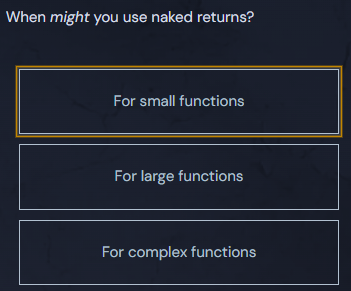

<h1>The Benefits of Named Returns</h1>

<svg class="details-icon" xmlns="http://www.w3.org/2000/svg" fill="none" viewBox="0 0 24 24" stroke-width="1.5" stroke="currentColor">
  <path d="m9 18 6-6-6-6"></path>
</svg>
<h2>Good for Documentation (Understanding)</h2>

Named return parameters are great for documenting a function. We know what the function is returning directly from its signature, no need for a comment.

Named return parameters are particularly important in longer functions with many return values.

  <pre class="language-go" tabindex="0"><code class="language-go">func calculator(a, b int) (mul, div int, err error) {
    if b == 0 {
      return 0, 0, errors.New("can't divide by zero")
    }
    mul = a * b
    div = a / b
    return mul, div, nil
}
</code></pre>

  <button class="markdown-it-code-copy absolute right-2 top-2.5 z-10 m-1 h-6 w-6 cursor-pointer rounded bg-gray-950 text-gray-500 focus:outline-white hover:text-gray-200" data-clipboard-text="func calculator(a, b int) (mul, div int, err error) {
    if b == 0 {
      return 0, 0, errors.New(&quot;can't divide by zero&quot;)
    }
    mul = a * b
    div = a / b
    return mul, div, nil
}" title="Copy to clipboard">
    <svg data-slot="icon" aria-hidden="true" fill="none" stroke-width="1.5" stroke="currentColor" viewBox="0 0 24 24" xmlns="http://www.w3.org/2000/svg">
      <rect width="8" height="4" x="8" y="2" rx="1" ry="1"></rect><path d="M16 4h2a2 2 0 0 1 2 2v14a2 2 0 0 1-2 2H6a2 2 0 0 1-2-2V6a2 2 0 0 1 2-2h2"></path>
  </svg>
  </button>

Which is easier to understand than:

  <pre class="language-go" tabindex="0"><code class="language-go">func calculator(a, b int) (int, int, error) {
    if b == 0 {
      return 0, 0, errors.New("can't divide by zero")
    }
    mul := a * b
    div := a / b
    return mul, div, nil
}
</code></pre>

  <button class="markdown-it-code-copy absolute right-2 top-2.5 z-10 m-1 h-6 w-6 cursor-pointer rounded bg-gray-950 text-gray-500 focus:outline-white hover:text-gray-200" data-clipboard-text="func calculator(a, b int) (int, int, error) {
    if b == 0 {
      return 0, 0, errors.New(&quot;can't divide by zero&quot;)
    }
    mul := a * b
    div := a / b
    return mul, div, nil
}" title="Copy to clipboard">
    <svg data-slot="icon" aria-hidden="true" fill="none" stroke-width="1.5" stroke="currentColor" viewBox="0 0 24 24" xmlns="http://www.w3.org/2000/svg">
      <rect width="8" height="4" x="8" y="2" rx="1" ry="1"></rect><path d="M16 4h2a2 2 0 0 1 2 2v14a2 2 0 0 1-2 2H6a2 2 0 0 1-2-2V6a2 2 0 0 1 2-2h2"></path>
  </svg>
  </button>

We know <em>the meaning</em> of each return value just by looking at the function signature: <code>func calculator(a, b int) (mul, div int, err error)</code>

<code>nil</code> is the zero value of an error. More on this later.

<svg class="details-icon" xmlns="http://www.w3.org/2000/svg" fill="none" viewBox="0 0 24 24" stroke-width="1.5" stroke="currentColor">
  <path d="m9 18 6-6-6-6"></path>
</svg>
<h2>Less Code (Sometimes)</h2>

If there are multiple return statements in a function, you don’t need to write all the return values each time, though you <em>probably</em> should.

When you choose to omit return values, it's called a <em>naked</em> return. Naked returns should only be used in short and simple functions.

## Quiz Results

*Quiz completed successfully*