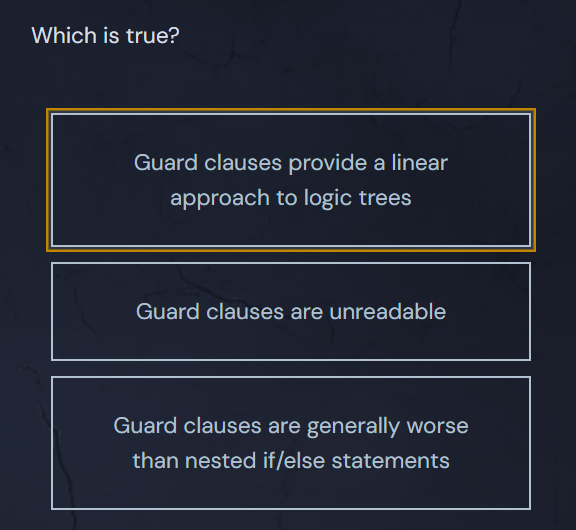

<h1>Early Returns</h1>

Go supports the ability to return early from a function. This is a powerful feature that can clean up code, especially when used as guard clauses.

Guard Clauses leverage the ability to <code>return</code> early from a function (or <code>continue</code> through a loop) to make nested conditionals one-dimensional. Instead of using if/else chains, we just return early from the function at the end of each conditional block.

  <pre class="language-go" tabindex="0"><code class="language-go">func divide(dividend, divisor int) (int, error) {
	if divisor == 0 {
		return 0, errors.New("can't divide by zero")
	}
	return dividend/divisor, nil
}
</code></pre>

  <button class="markdown-it-code-copy absolute right-2 top-2.5 z-10 m-1 h-6 w-6 cursor-pointer rounded bg-gray-950 text-gray-500 focus:outline-white hover:text-gray-200" data-clipboard-text="func divide(dividend, divisor int) (int, error) {
	if divisor == 0 {
		return 0, errors.New("can't divide by zero")
	}
	return dividend/divisor, nil
}" title="Copy to clipboard">
    <svg data-slot="icon" aria-hidden="true" fill="none" stroke-width="1.5" stroke="currentColor" viewBox="0 0 24 24" xmlns="http://www.w3.org/2000/svg">
      <rect width="8" height="4" x="8" y="2" rx="1" ry="1"></rect><path d="M16 4h2a2 2 0 0 1 2 2v14a2 2 0 0 1-2 2H6a2 2 0 0 1-2-2V6a2 2 0 0 1 2-2h2"></path>
  </svg>
  </button>

Error handling in Go naturally encourages developers to make use of guard clauses. When I started writing more JavaScript, I was disappointed to see how many nested conditionals existed in the code I was working on.

Let’s take a look at an exaggerated example of nested conditional logic:

  <pre class="language-go" tabindex="0"><code class="language-go">func getInsuranceAmount(status insuranceStatus) int {
  amount := 0
  if !status.hasInsurance(){
    amount = 1
  } else {
    if status.isTotaled(){
      amount = 10000
    } else {
      if status.isDented(){
        amount = 160
        if status.isBigDent(){
          amount = 270
        }
      } else {
        amount = 0
      }
    }
  }
  return amount
}
</code></pre>

  <button class="markdown-it-code-copy absolute right-2 top-2.5 z-10 m-1 h-6 w-6 cursor-pointer rounded bg-gray-950 text-gray-500 focus:outline-white hover:text-gray-200" data-clipboard-text="func getInsuranceAmount(status insuranceStatus) int {
  amount := 0
  if !status.hasInsurance(){
    amount = 1
  } else {
    if status.isTotaled(){
      amount = 10000
    } else {
      if status.isDented(){
        amount = 160
        if status.isBigDent(){
          amount = 270
        }
      } else {
        amount = 0
      }
    }
  }
  return amount
}" title="Copy to clipboard">
    <svg data-slot="icon" aria-hidden="true" fill="none" stroke-width="1.5" stroke="currentColor" viewBox="0 0 24 24" xmlns="http://www.w3.org/2000/svg">
      <rect width="8" height="4" x="8" y="2" rx="1" ry="1"></rect><path d="M16 4h2a2 2 0 0 1 2 2v14a2 2 0 0 1-2 2H6a2 2 0 0 1-2-2V6a2 2 0 0 1 2-2h2"></path>
  </svg>
  </button>

This could be written with guard clauses instead:

  <pre class="language-go" tabindex="0"><code class="language-go">func getInsuranceAmount(status insuranceStatus) int {
  if !status.hasInsurance(){
    return 1
  }
  if status.isTotaled(){
    return 10000
  }
  if !status.isDented(){
    return 0
  }
  if status.isBigDent(){
    return 270
  }
  return 160
}
</code></pre>

  <button class="markdown-it-code-copy absolute right-2 top-2.5 z-10 m-1 h-6 w-6 cursor-pointer rounded bg-gray-950 text-gray-500 focus:outline-white hover:text-gray-200" data-clipboard-text="func getInsuranceAmount(status insuranceStatus) int {
  if !status.hasInsurance(){
    return 1
  }
  if status.isTotaled(){
    return 10000
  }
  if !status.isDented(){
    return 0
  }
  if status.isBigDent(){
    return 270
  }
  return 160
}" title="Copy to clipboard">
    <svg data-slot="icon" aria-hidden="true" fill="none" stroke-width="1.5" stroke="currentColor" viewBox="0 0 24 24" xmlns="http://www.w3.org/2000/svg">
      <rect width="8" height="4" x="8" y="2" rx="1" ry="1"></rect><path d="M16 4h2a2 2 0 0 1 2 2v14a2 2 0 0 1-2 2H6a2 2 0 0 1-2-2V6a2 2 0 0 1 2-2h2"></path>
  </svg>
  </button>

The example above is <em>much</em> easier to read and understand. When writing code, it’s important to try to reduce the cognitive load on the reader by reducing the number of entities they need to think about at any given time.

In the first example, if the developer is trying to figure out when <code>270</code> is returned, they need to think about each branch in the logic tree and try to remember which cases matter and which cases don’t. With the one-dimensional structure offered by guard clauses, it’s as simple as stepping through each case in order.

## Quiz Results

*Quiz completed successfully*