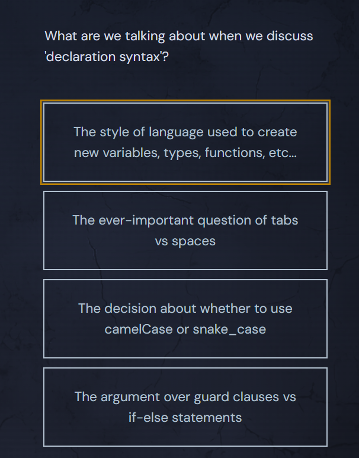

<h1>Declaration Syntax</h1>

Developers often wonder why the declaration syntax in Go is different from the tradition established in the C family of languages.

<svg class="details-icon" xmlns="http://www.w3.org/2000/svg" fill="none" viewBox="0 0 24 24" stroke-width="1.5" stroke="currentColor">
  <path d="m9 18 6-6-6-6"></path>
</svg>
<h2>C-Style Syntax</h2>

The C language describes types with an expression including the name to be declared, and states what type that expression will have.

  <pre class="language-c" tabindex="0"><code class="language-c">int y;
</code></pre>

  <button class="markdown-it-code-copy absolute right-2 top-2.5 z-10 m-1 h-6 w-6 cursor-pointer rounded bg-gray-950 text-gray-500 focus:outline-white hover:text-gray-200" data-clipboard-text="int y;" title="Copy to clipboard">
    <svg data-slot="icon" aria-hidden="true" fill="none" stroke-width="1.5" stroke="currentColor" viewBox="0 0 24 24" xmlns="http://www.w3.org/2000/svg">
      <rect width="8" height="4" x="8" y="2" rx="1" ry="1"></rect><path d="M16 4h2a2 2 0 0 1 2 2v14a2 2 0 0 1-2 2H6a2 2 0 0 1-2-2V6a2 2 0 0 1 2-2h2"></path>
  </svg>
  </button>

The code above declares <code>y</code> as an <code>int</code>. In general, the type goes on the left and the expression on the right.

Interestingly, the creators of the Go language agreed that the C-style of declaring types in signatures gets confusing really fast - take a look at this nightmare.

  <pre class="language-c" tabindex="0"><code class="language-c">int (*fp)(int (*ff)(int x, int y), int b)
</code></pre>

  <button class="markdown-it-code-copy absolute right-2 top-2.5 z-10 m-1 h-6 w-6 cursor-pointer rounded bg-gray-950 text-gray-500 focus:outline-white hover:text-gray-200" data-clipboard-text="int (*fp)(int (*ff)(int x, int y), int b)" title="Copy to clipboard">
    <svg data-slot="icon" aria-hidden="true" fill="none" stroke-width="1.5" stroke="currentColor" viewBox="0 0 24 24" xmlns="http://www.w3.org/2000/svg">
      <rect width="8" height="4" x="8" y="2" rx="1" ry="1"></rect><path d="M16 4h2a2 2 0 0 1 2 2v14a2 2 0 0 1-2 2H6a2 2 0 0 1-2-2V6a2 2 0 0 1 2-2h2"></path>
  </svg>
  </button>

<svg class="details-icon" xmlns="http://www.w3.org/2000/svg" fill="none" viewBox="0 0 24 24" stroke-width="1.5" stroke="currentColor">
  <path d="m9 18 6-6-6-6"></path>
</svg>
<h2>Go-Style Syntax</h2>

Go's declarations are clear, you just read them left to right, just like you would in English.

  <pre class="language-go" tabindex="0"><code class="language-go">x int
p *int
a [3]int
</code></pre>

  <button class="markdown-it-code-copy absolute right-2 top-2.5 z-10 m-1 h-6 w-6 cursor-pointer rounded bg-gray-950 text-gray-500 focus:outline-white hover:text-gray-200" data-clipboard-text="x int
p *int
a [3]int" title="Copy to clipboard">
    <svg data-slot="icon" aria-hidden="true" fill="none" stroke-width="1.5" stroke="currentColor" viewBox="0 0 24 24" xmlns="http://www.w3.org/2000/svg">
      <rect width="8" height="4" x="8" y="2" rx="1" ry="1"></rect><path d="M16 4h2a2 2 0 0 1 2 2v14a2 2 0 0 1-2 2H6a2 2 0 0 1-2-2V6a2 2 0 0 1 2-2h2"></path>
  </svg>
  </button>

It's nice for more complex signatures, it makes them easier to read.

  <pre class="language-go" tabindex="0"><code class="language-go">f func(func(int,int) int, int) int
</code></pre>

  <button class="markdown-it-code-copy absolute right-2 top-2.5 z-10 m-1 h-6 w-6 cursor-pointer rounded bg-gray-950 text-gray-500 focus:outline-white hover:text-gray-200" data-clipboard-text="f func(func(int,int) int, int) int" title="Copy to clipboard">
    <svg data-slot="icon" aria-hidden="true" fill="none" stroke-width="1.5" stroke="currentColor" viewBox="0 0 24 24" xmlns="http://www.w3.org/2000/svg">
      <rect width="8" height="4" x="8" y="2" rx="1" ry="1"></rect><path d="M16 4h2a2 2 0 0 1 2 2v14a2 2 0 0 1-2 2H6a2 2 0 0 1-2-2V6a2 2 0 0 1 2-2h2"></path>
  </svg>
  </button>

<svg class="details-icon" xmlns="http://www.w3.org/2000/svg" fill="none" viewBox="0 0 24 24" stroke-width="1.5" stroke="currentColor">
  <path d="m9 18 6-6-6-6"></path>
</svg>
<h2>Reference</h2>

The <a href="https://blog.golang.org/declaration-syntax" target="_blank" rel="noopener nofollow">following post on the Go blog</a> is a great resource for further reading on declaration syntax.

## Quiz Results

*Quiz completed successfully*