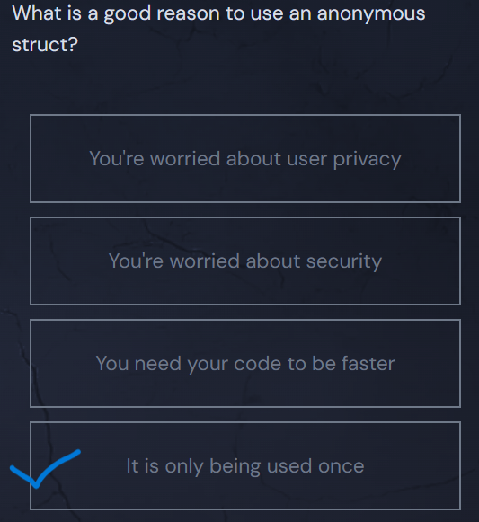

<h1>Anonymous Structs in Go</h1>

An anonymous struct is just like a normal struct, but it is defined without a name and therefore cannot be referenced elsewhere in the code.

To create an anonymous struct, just instantiate the instance immediately using a second pair of brackets after declaring the type:

  <pre class="language-go" tabindex="0"><code class="language-go">myCar := struct {
  brand string
  model string
} {
  brand: "Toyota",
  model: "Camry",
}
</code></pre>

  <button class="markdown-it-code-copy absolute right-2 top-2.5 z-10 m-1 h-6 w-6 cursor-pointer rounded bg-gray-950 text-gray-500 focus:outline-white hover:text-gray-200" data-clipboard-text="myCar := struct {
  brand string
  model string
} {
  brand: &quot;Toyota&quot;,
  model: &quot;Camry&quot;,
}" title="Copy to clipboard">
    <svg data-slot="icon" aria-hidden="true" fill="none" stroke-width="1.5" stroke="currentColor" viewBox="0 0 24 24" xmlns="http://www.w3.org/2000/svg">
      <rect width="8" height="4" x="8" y="2" rx="1" ry="1"></rect><path d="M16 4h2a2 2 0 0 1 2 2v14a2 2 0 0 1-2 2H6a2 2 0 0 1-2-2V6a2 2 0 0 1 2-2h2"></path>
  </svg>
  </button>

You can even nest anonymous structs as fields within other structs:

  <pre class="language-go" tabindex="0"><code class="language-go">type car struct {
  brand string
  model string
  doors int
  mileage int
  // wheel is a field containing an anonymous struct
  wheel struct {
    radius int
    material string
  }
}
</code></pre>

  <button class="markdown-it-code-copy absolute right-2 top-2.5 z-10 m-1 h-6 w-6 cursor-pointer rounded bg-gray-950 text-gray-500 focus:outline-white hover:text-gray-200" data-clipboard-text="type car struct {
  brand string
  model string
  doors int
  mileage int
  // wheel is a field containing an anonymous struct
  wheel struct {
    radius int
    material string
  }
}" title="Copy to clipboard">
    <svg data-slot="icon" aria-hidden="true" fill="none" stroke-width="1.5" stroke="currentColor" viewBox="0 0 24 24" xmlns="http://www.w3.org/2000/svg">
      <rect width="8" height="4" x="8" y="2" rx="1" ry="1"></rect><path d="M16 4h2a2 2 0 0 1 2 2v14a2 2 0 0 1-2 2H6a2 2 0 0 1-2-2V6a2 2 0 0 1 2-2h2"></path>
  </svg>
  </button>

<svg class="details-icon" xmlns="http://www.w3.org/2000/svg" fill="none" viewBox="0 0 24 24" stroke-width="1.5" stroke="currentColor">
  <path d="m9 18 6-6-6-6"></path>
</svg>
<h2>When Should You Use an Anonymous Struct?</h2>

In general, <em>prefer named structs</em>. Named structs make it easier to read and understand your code, and they have the nice side-effect of being reusable. I sometimes use anonymous structs when I <em>know</em> I won't ever need to use a struct again. For example, sometimes I'll use one to create the shape of some JSON data in HTTP handlers.

If a struct is only meant to be used once, then it makes sense to declare it in such a way that developers down the road won’t be tempted to accidentally use it again.

You can read more about <a href="https://blog.boot.dev/golang/anonymous-structs-golang/" target="_blank" rel="noopener nofollow">anonymous structs here</a> if you're curious.

## Quiz Results

*Quiz completed successfully*